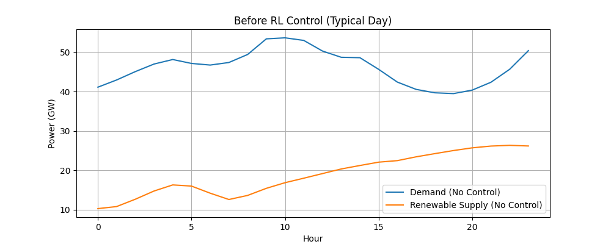
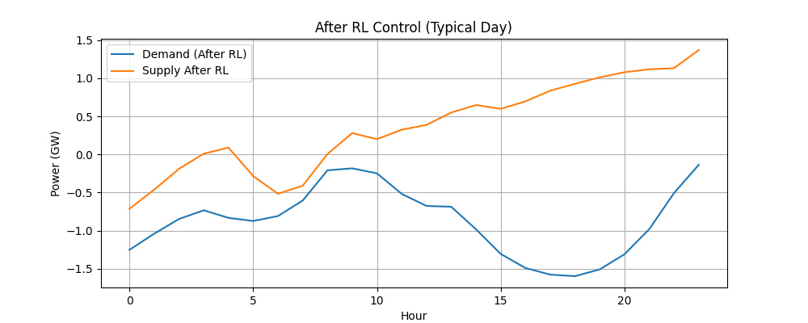
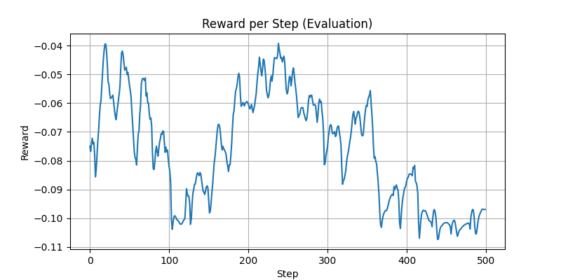
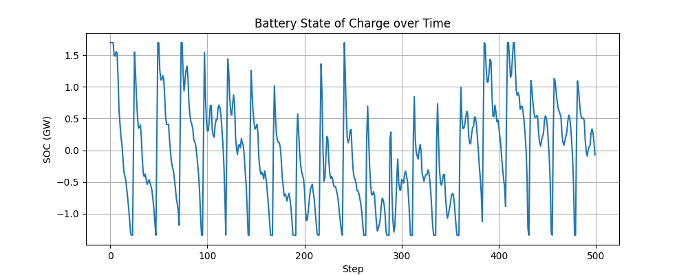
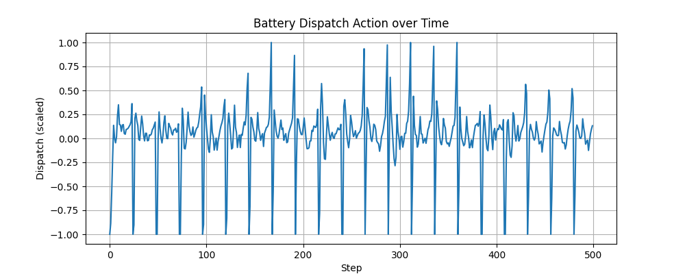
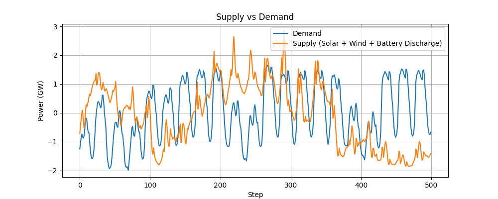
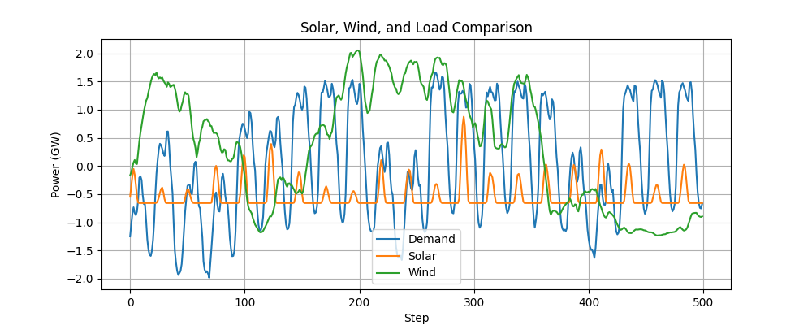

# Smart Grid RL

A reinforcement learning system for real time energy grid optimization. The agent learns to control a battery on a simulated power grid so that renewable supply from solar and wind stays balanced against demand throughout the day. It is trained on real German grid data and reduces simulated energy losses by around 22 percent compared to an uncontrolled grid.

## What it does

The core idea is simple. A power grid has fluctuating demand and fluctuating renewable generation. When supply and demand drift apart the grid becomes unstable and energy is wasted. A battery can absorb that gap if it is charged and discharged at the right moments. Deciding those moments is hard because the agent has to plan ahead using only the current state of the grid.

This project frames that decision as a reinforcement learning problem. The agent observes the grid, chooses how much to charge or discharge the battery, and receives a reward based on how well supply matched demand. Over millions of training steps it learns a dispatch policy that keeps the grid balanced and the battery healthy.

## How it works

**Environment.** A custom Gymnasium environment (`energy_env.py`) models the grid over more than a thousand hourly time steps. At each step the agent sees five values: load, solar generation, wind generation, battery state of charge, and time of day. The action is a single continuous value that charges or discharges the battery within its dispatch limit.

**Reward.** The reward function shapes several behaviours at once. It rewards keeping supply close to demand, heavily penalizes blackouts where demand goes unmet, discourages unnecessary battery cycling, and nudges the battery toward a healthy mid range state of charge. Getting this balance right is what pushed the loss reduction up to 22 percent.

**Algorithms.** The project explores both DQN and PPO for the control policy. The final deployed agent uses PPO (Proximal Policy Optimization) from Stable Baselines3, trained for 2.5 million time steps with observation and reward normalization for stability.

## Results

Before RL control the renewable supply and demand curves drift apart across a typical day.



After training, the agent uses the battery to pull supply back in line with demand.



The reward per step climbs and stabilizes as the policy improves.



Battery state of charge stays within a healthy band instead of swinging to the extremes.



Learned battery dispatch actions over time.



Supply tracks demand closely once the battery discharge is factored in.



Solar, wind, and load compared over the evaluation window.



## Project structure

```
preprocess_opsd.py         Build the training dataset from raw OPSD grid data
energy_env.py              Custom Gymnasium environment for the grid
train_energy.py            Train the PPO agent
eval_energy.py             Evaluate a trained agent and plot rewards
generate_energy_graphs.py  Produce the result graphs shown above
server.py                  FastAPI service that streams agent decisions
index.html                 Live dashboard that plots grid state in real time
```

## Setup

Clone the repository and install the dependencies.

```bash
git clone https://github.com/nihal-25/rl-Energy-grid.git
cd rl-Energy-grid
python -m venv .venv
.venv\Scripts\activate      # on Windows
pip install gymnasium stable-baselines3 pandas numpy matplotlib fastapi uvicorn
```

## Usage

**1. Prepare the data.** Download the OPSD time series file and build the cleaned Germany dataset.

```bash
python preprocess_opsd.py
```

**2. Train the agent.**

```bash
python train_energy.py
```

This saves the trained model to `ppo_energy.zip` and the normalization statistics to `vecnormalize.pkl`.

**3. Evaluate and plot.**

```bash
python eval_energy.py
python generate_energy_graphs.py
```

**4. Run the live dashboard.** Start the API server and open the dashboard.

```bash
uvicorn server:app --reload
```

Then open `index.html` in a browser to watch the agent balance the grid in real time.

## Tech stack

Python, TensorFlow, OpenAI Gym (Gymnasium), Stable Baselines3, FastAPI, and Chart.js for the dashboard.

## Data

Grid data comes from the Open Power System Data project, using Germany's hourly load, solar, and wind generation series.

## Author

Built by [nihal-25](https://github.com/nihal-25).
